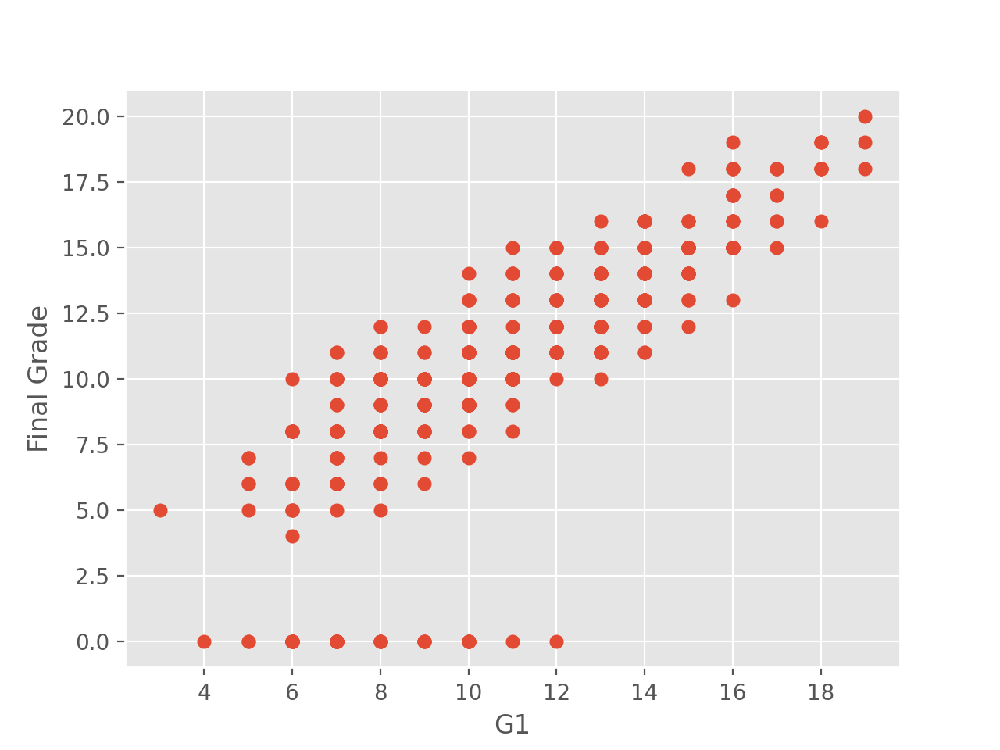
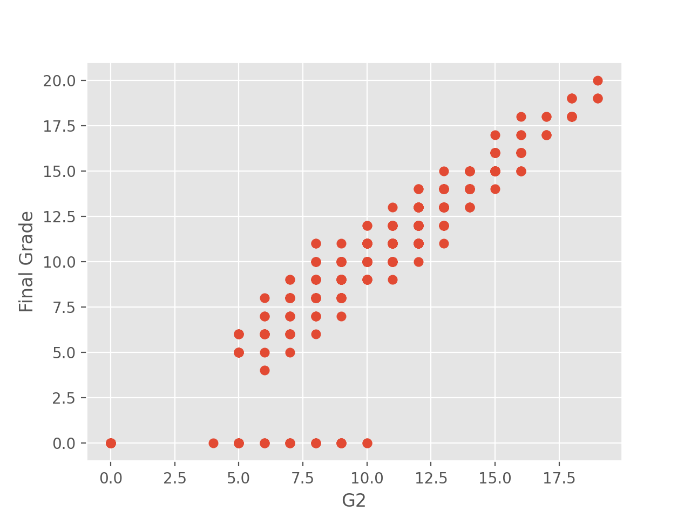
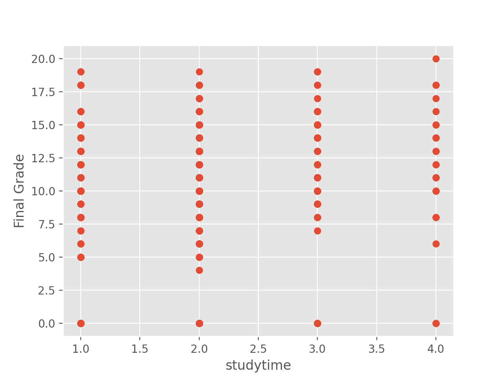
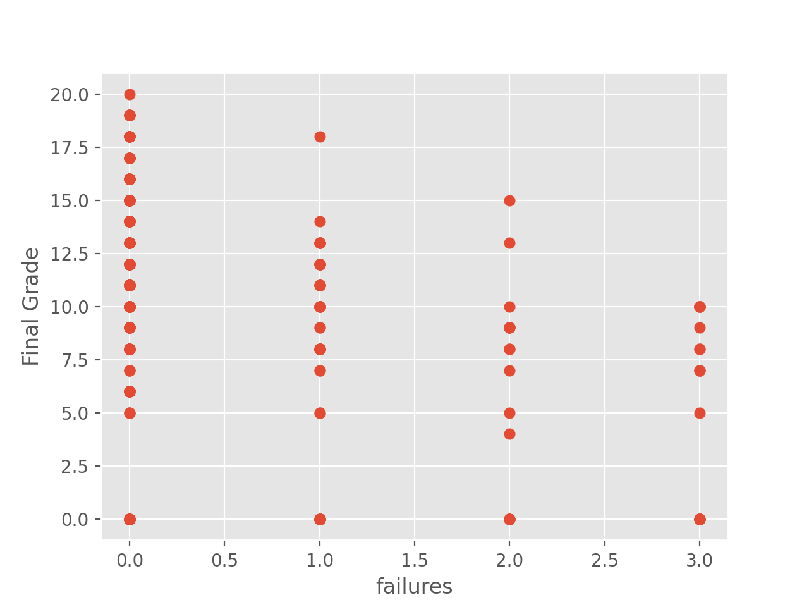
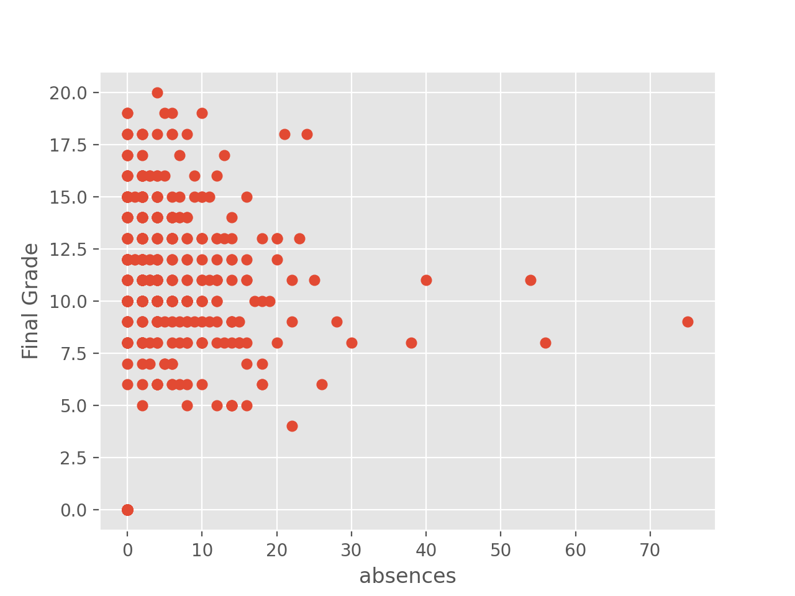

# Linear Regression Model
Using data of students gathered on the internet, and using the help of tensor flow library linear regression model, predict the final grade of students given the Midterms' grade, absences, studytime etc.

A graph of the relationship between each data to the final grade of each student

G1: 
G2: 
Study Time: 
Failures: 
Absences: 
